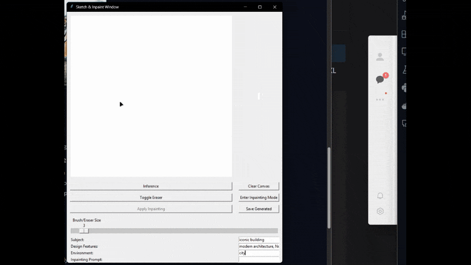

# Stable Diffusion XL Interactive Sketch & Inpainting Local App

This repository contains a **Tkinter-based** Python application that allows users to:
1. **Sketch** directly on a canvas (or import a base image) and generate images using **Stable Diffusion XL** + **ControlNet**.
2. **Inpaint** specific regions on the generated image (e.g., erase or replace content) using Stable Diffusion XL’s inpainting pipeline.
   
NOTE: Everything can be run locally

 

## Table of Contents
1. [Overview](#overview)
2. [Features](#features)
3. [Installation & Setup](#installation--setup)
4. [Usage](#usage)
5. [Demo GIFs](#demo-gifs)
6. [Long Video Demonstration](#long-video-demonstration)
7. [Project Structure](#project-structure)
8. [Technical Details](#technical-details)
9. [Roadmap & Future Improvements](#roadmap--future-improvements)
10. [License](#license)

---

## Overview

This application leverages the [Diffusers library](https://github.com/huggingface/diffusers) and multiple **Stable Diffusion XL** pipelines to offer an interactive interface for generating and editing images. By integrating **ControlNet**, the user’s sketch is respected as a guidance map, ensuring the final output aligns with the original drawing. In **inpainting mode**, users can paint a mask directly on the generated result to refine or alter specific details in the image.

Example applications:
- Quick concept art generation
- Generating variations of a manually drawn design
- Editing or refining existing AI-generated images

**Key technologies**:
- **Python 3.9+**
- **Torch (CUDA-enabled)**
- **Hugging Face Diffusers**
- **Stable Diffusion XL** (with ControlNet + Inpainting models)
- **Tkinter** for GUI
- **Pillow (PIL)** for image manipulation

---

## Features

1. **Sketch to Image**  
   - Draw simple sketches or outlines on a white canvas.
   - Real-time inference triggers to generate preview images using SDXL + ControlNet.  
   - Customizable prompts (subject, style, environment, etc.).

2. **Inpainting Mode**  
   - Switch to inpainting mode to refine or modify parts of the generated image.
   - Paint a mask (in red) onto areas you want to replace.
   - Click "Apply Inpainting" to let the SDXL inpainting pipeline fill the masked areas.

3. **Undo & Eraser**  
   - Undo your last stroke (in regular sketch mode).
   - Toggle eraser vs. brush for quick corrections.

4. **Prompt-based**  
   - Simple text input fields to craft unique prompts.
   - Negative prompts to avoid undesired content.

5. **Saving Results**  
   - Save your generated images in multiple formats (JPEG, PNG, etc.).

---

## Models Used

The code leverages several pretrained models from Hugging Face:

  1. ControlNet Model: [xinsir/controlnet-scribble-sdxl-1.0](https://huggingface.co/xinsir/controlnet-scribble-sdxl-1.0)
  2. Stable Diffusion XL Base Model (with ControlNet): [SG161222/RealVisXL_V4.0_Lightning](https://huggingface.co/SG161222/RealVisXL_V4.0_Lightning)
  3. Inpainting Pipeline Model: [diffusers/stable-diffusion-xl-1.0-inpainting-0.1](https://huggingface.co/diffusers/stable-diffusion-xl-1.0-inpainting-0.1)
  
  Note: You can substitute these models with similar SDXL-compatible ControlNet or inpainting models if desired.

---

## Usage

1. **Sketch on the left canvas** using the default black brush.  
   - Adjust brush size with the slider.  
   - **Undo** (`Ctrl+Z`) to revert the last stroke.  
   - **Toggle Eraser** to switch between drawing and erasing.

2. **Enter prompts** in the text fields:  
   - **Subject** (e.g., *a futuristic car*)  
   - **Design Features** (e.g., *sleek lines, aerodynamic*)  
   - **Environment** (e.g., *cyberpunk city at night*)

3. **Click "Inference"** to generate a preview image on the right panel.

4. **(Optional) Inpainting**:  
   - Once satisfied with a generated image, click "Enter Inpainting Mode."  
   - Paint red **mask** strokes on the areas you want to modify.  
   - Click "Apply Inpainting" to update those masked regions.  
   - Click "Exit Inpainting Mode" to return to normal sketching mode.

5. **Save your image** by clicking "Save Generated."

---

## Demo GIFs

Below are placeholders for two short demo GIFs showcasing the main workflow:

1. **Demo: Sketch to Image**  

   
 
   

---

## Video Demonstration

  ` 

---

## Technical Details

1. **Stable Diffusion XL Pipeline**  
   - Used [`StableDiffusionXLControlNetPipeline`](https://huggingface.co/docs/diffusers/api/pipelines/controlnet#diffusers.StableDiffusionXLControlNetPipeline) to condition the generation on the user’s sketch.  
   - Employed [`AutoPipelineForInpainting`](https://huggingface.co/docs/diffusers/api/pipelines/auto#diffusers.AutoPipelineForInpainting) for targeted refinements in the inpainting workflow.

2. **ControlNet**  
   - **ControlNet** ensures the user’s sketch (converted to an **inverted grayscale** image) influences the generated result. We set `controlnet_conditioning_scale` to control how strongly the sketch shapes the output.

3. **Inpainting Approach**  
   - A separate model or pipeline is used for inpainting. We produce a **mask** from the user’s red strokes and pass it alongside the base image to fill in the masked areas.

4. **GUI with Tkinter**  
   - **Canvas** element to draw lines, handle mouse events, and store user strokes.  
   - **ImageDraw** from the Pillow library keeps an internal representation of the user’s drawing for inference.

5. **Performance Considerations**  
   - Generating images with SDXL can be GPU-intensive.  
   - The number of **inference steps** or the **image resolution** can be tuned to fit performance constraints.

---

## Roadmap & Future Improvements

1. **Dynamic ControlNet Strength**  
   - Expose a slider to let users dynamically adjust how strongly the ControlNet input influences the final image.

2. **Better Inpainting Mask Overlay**  
   - Provide a semi-transparent overlay instead of painting in pure red for an improved user experience.

3. **Prompt Templates**  
   - Include preset prompts for quick concept generation (e.g., *portrait, landscape, cartoonish*, etc.).

4. **Auto-Resize Sketch**  
   - Optionally keep the user canvas size flexible, adjusting the model’s input resolution accordingly.

5. **Additional Post-Processing**  
   - Integrate upscaling pipelines.

---
